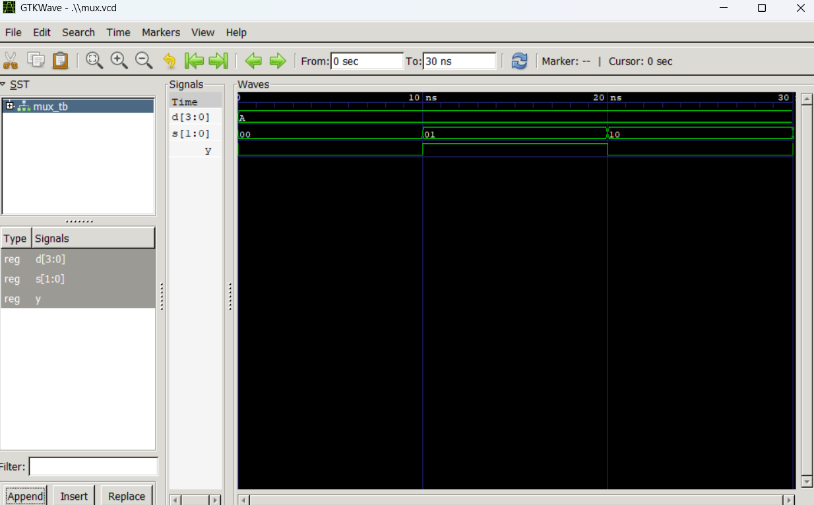
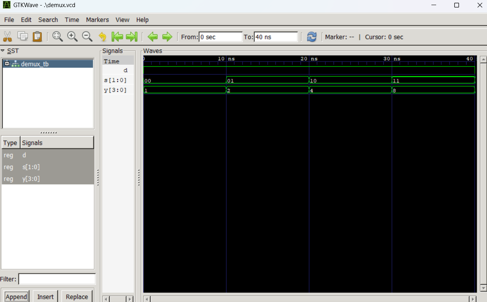

# Lab 4: VHDL Code for Combinational Circuits (MUX and DEMUX)

**Course:** Computer Architecture (CMP 262)
**Program:** Bachelor of Computer Engineering
**Semester:** Fourth Semester
**College:** Cosmos College of Management and Technology
**Department:** Department of Information and Communication Technology

---

## Objective

- To design and simulate a **4-to-1 Multiplexer (MUX)** in VHDL.
- To design and simulate a **1-to-4 Demultiplexer (DEMUX)** in VHDL.
- To understand how combinational circuits route data based on control signals.

---

## Theory

### Multiplexer (MUX)

A multiplexer is a combinational circuit that selects one of **2ⁿ input data lines** and routes it to a **single output** based on **n select lines**.

**4-to-1 MUX:**
- **4 data inputs:** D0, D1, D2, D3
- **2 select lines:** S1, S0
- **1 output:** Y

**Truth Table:**

| S1 | S0 | Y |
|----|----|-------|
| 0 | 0 | D0 |
| 0 | 1 | D1 |
| 1 | 0 | D2 |
| 1 | 1 | D3 |

**Function:** The select lines act like an address to "pick" which input appears at the output. It's like a data selector.

---

### Demultiplexer (DEMUX)

A demultiplexer is a combinational circuit that routes a **single input** to one of **2ⁿ output lines** based on **n select lines**.

**1-to-4 DEMUX:**
- **1 data input:** D
- **2 select lines:** S1, S0
- **4 outputs:** Y0, Y1, Y2, Y3

**Truth Table:**

| S1 | S0 | Y0 | Y1 | Y2 | Y3 |
|----|----|----|----|----|----| 
| 0 | 0 | D | 0 | 0 | 0 |
| 0 | 1 | 0 | D | 0 | 0 |
| 1 | 0 | 0 | 0 | D | 0 |
| 1 | 1 | 0 | 0 | 0 | D |

**Function:** The select lines determine which output line receives the input data. All other outputs remain 0. It's like a data distributor.

---

## MUX vs DEMUX Comparison

| Aspect | MUX | DEMUX |
|--------|-----|-------|
| **Function** | Routes **one of many inputs** to a **single output** | Routes a **single input** to **one of many outputs** |
| **Purpose** | Data selection/compression | Data distribution/expansion |
| **Inverse** | DEMUX | MUX |
| **Logic** | "Which input goes out?" | "Which output gets the input?" |

---

## VHDL Implementation

### 4-to-1 Multiplexer Architecture

```vhdl
architecture Behavioral of MUX_4TO1 is
begin
  process(D, S)
  begin
    case S is
      when "00" => Y <= D(0);  -- Select input 0
      when "01" => Y <= D(1);  -- Select input 1
      when "10" => Y <= D(2);  -- Select input 2
      when "11" => Y <= D(3);  -- Select input 3
      when others => Y <= '0';
    end case;
  end process;
end architecture Behavioral;
```

**Key Points:**
- Uses a `case` statement to decode the select lines
- Each select value maps to an index in the input vector D
- The selected bit is assigned to output Y

### 1-to-4 Demultiplexer Architecture

```vhdl
architecture Behavioral of DEMUX_1TO4 is
begin
  process(D, S)
  begin
    Y <= "0000";  -- Initialize all outputs to 0
    case S is
      when "00" => Y(0) <= D;  -- Route to output 0
      when "01" => Y(1) <= D;  -- Route to output 1
      when "10" => Y(2) <= D;  -- Route to output 2
      when "11" => Y(3) <= D;  -- Route to output 3
      when others => null;
    end case;
  end process;
end architecture Behavioral;
```

**Key Points:**
- Initializes all output bits to 0
- Each select value maps to an index in the output vector Y
- The input D is assigned to only one output bit

---

## Simulation

### Compile and Simulate MUX

```bash
# Analyze (compile) the design and testbench
ghdl -a mux_4to1.vhd mux_tb.vhd

# Elaborate the testbench
ghdl -e MUX_TB

# Run simulation and generate VCD file
ghdl -r MUX_TB --vcd=mux.vcd

# View waveforms in GTKWave
gtkwave mux.vcd
```

### Compile and Simulate DEMUX

```bash
# Analyze (compile) the design and testbench
ghdl -a demux_1to4.vhd demux_tb.vhd

# Elaborate the testbench
ghdl -e DEMUX_TB

# Run simulation and generate VCD file
ghdl -r DEMUX_TB --vcd=demux.vcd

# View waveforms in GTKWave
gtkwave demux.vcd
```

---

## Simulation Results

### MUX Waveform Output



**Observations:**
- **D = 1010** (D3=1, D2=0, D1=1, D0=0)
- **S=00:** Y = 0 (selects D0)
- **S=01:** Y = 1 (selects D1)
- **S=10:** Y = 0 (selects D2)
- **S=11:** Y = 1 (selects D3)

### DEMUX Waveform Output



**Observations:**
- **D = 1** (constant input)
- **S=00:** Y = 0001 (D routed to Y0)
- **S=01:** Y = 0010 (D routed to Y1)
- **S=10:** Y = 0100 (D routed to Y2)
- **S=11:** Y = 1000 (D routed to Y3)
- **D=0, S=10:** Y = 0000 (0 routed to Y2, but display shows all zeros)

---

## Files in This Lab

| File | Description |
|------|-------------|
| `mux_4to1.vhd` | 4-to-1 Multiplexer entity and architecture |
| `mux_tb.vhd` | Testbench for MUX with stimulus |
| `mux.vcd` | Waveform data file for MUX simulation |
| `demux_1to4.vhd` | 1-to-4 Demultiplexer entity and architecture |
| `demux_tb.vhd` | Testbench for DEMUX with stimulus |
| `demux.vcd` | Waveform data file for DEMUX simulation |
| `mux.png` | Screenshot of MUX simulation waveform |
| `demux.png` | Screenshot of DEMUX simulation waveform |

---

## Key Learning Points

1. **Combinational Logic:** MUX and DEMUX are purely combinational circuits (no memory or clock).
2. **Control Signals:** Select lines (S1 S0) determine the behavior — a decoder for MUX/DEMUX routing.
3. **Inverse Relationship:** DEMUX is the functional inverse of MUX.
4. **VHDL Case Statement:** Used to implement multi-way logic decisions elegantly.
5. **Testbench Verification:** Simulations confirm the truth table behavior in actual hardware description language.

---

## Conclusion

This lab successfully demonstrates the design and simulation of two fundamental combinational circuits:

- **MUX** selects and outputs one of many inputs
- **DEMUX** distributes a single input to many outputs

Both circuits are essential building blocks in digital systems for data routing, multiplexing communication channels, and control signal distribution. The VHDL implementations show how combinational logic can be described using behavioral modeling with case statements.

